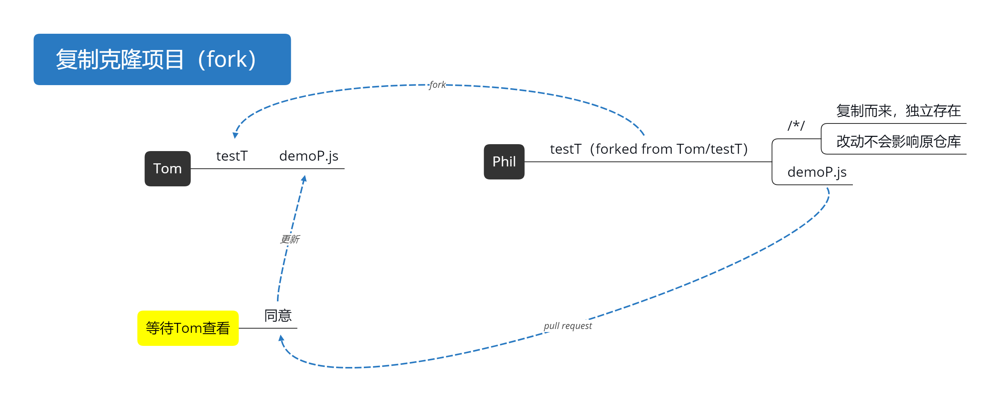

# 目的
###
# 基本概念

 - 仓库（repository）：用于存放项目代码，一个项目对应一个仓库。私有仓库只能自己或者指定的人才有权限操作。
 - 收藏（star）：收藏项目。
 - 克隆复制项目（fork）& 发起请求（Pull Request）：
 - 关注（Watch）：关注项目后，项目更新会收到通知。
 - 事务卡片（Issue）：开源项目后其他人对项目中有缺陷的地方提出Issue，修复解决后可以close。
 - Github主页：左侧显示用户动态以及关注用户/关注仓库的动态；右侧显示本人的所有git库。
 - 仓库主页：显示项目代码、版本、收藏/关注/fork情况等。
 - 个人主页：个人信息等。